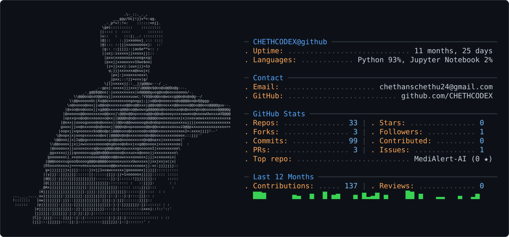

<picture>
  <source media="(prefers-color-scheme: dark)" srcset="dark_mode.svg" />
  <source media="(prefers-color-scheme: light)" srcset="light_mode.svg" />
  
</picture>

# CHETHAN S

### ServiceNow Developer • Machine Learning Engineer • AI Systems Builder

  

  

  

  

  

  
  
  

━━━━━━━━━━━━━━━━━━━━━━━━━━━━━━━━━━━━━━━━━━━━━━━━━━━━━━━━━━━━━━

---

# About

Computer Science & Engineering (IoT) undergraduate at **GITAM University, Bangalore**, focused on ServiceNow development, machine learning, RAG applications, and AI-powered IT systems.

| Profile | Details |
| --- | --- |
| Education | B.Tech Computer Science & Engineering (IoT) |
| University | GITAM University, Bangalore |
| CGPA | 8.5 |
| Current Role | Machine Learning Intern - URSC, ISRO |
| Certifications | ServiceNow CSA & CAD; Cisco Networking Basics |
| Focus | ServiceNow, Machine Learning & AI Systems |
| Interests | RAG, Anomaly Detection, ITSM & Cloud Systems |
| Goal | AI / ML Engineer and ServiceNow Developer |

---

# Technology Stack

### Languages, AI/ML, ServiceNow, Backend & Tooling

  

  <b>Python</b> • <b>Java</b> • <b>JavaScript</b> • <b>TypeScript</b> • <b>SQL</b> • <b>PostgreSQL</b> • <b>MongoDB</b> • <b>AWS</b> • <b>Docker</b>

  <b>ServiceNow CSA/CAD</b> • <b>Flow Designer</b> • <b>ITSM</b> • <b>Incident Management</b> • <b>Business Rules</b> • <b>Scripted REST APIs</b>

  <b>Machine Learning</b> • <b>Pandas</b> • <b>NumPy</b> • <b>Scikit-learn</b> • <b>Time-Series Forecasting</b> • <b>Anomaly Detection</b>

  <b>RAG</b> • <b>LangChain</b> • <b>ChromaDB</b> • <b>Vector Databases</b> • <b>FastAPI</b> • <b>REST APIs</b> • <b>spaCy NLP</b>

---

# GitHub Analytics & Development Activity

  

  

  

---

# Featured Projects

### [CineWatch AI](https://cine-watch-chi.vercel.app/)

AI-powered movie discovery platform using semantic vector search, Google Gemini embeddings, FastAPI, Next.js, and Supabase.

- Built natural-language movie discovery using 768-dimensional embeddings and cosine similarity.
- Developed REST APIs with Next.js/Node.js and FastAPI.
- Reduced server memory usage from 600 MB to 30 MB.

### [Bittu Chatbot - RAG Assistant](https://github.com/CHETHCODEX/BITTU_CHATBOT)

Full-stack RAG assistant built with FastAPI, ChromaDB, and React.

- Added PDF ingestion, semantic retrieval, and intent-based tool routing.
- Achieved 92%+ retrieval accuracy for semantic queries.
- Implemented multi-provider LLM failover and optimized retrieval latency.

### [Walmart Sales Forecasting](https://github.com/CHETHCODEX)

Data science project forecasting weekly sales across 45 stores and 81 departments.

- Used ARIMA, Holt-Winters, Random Forest, and Linear Regression.
- Performed EDA, correlation analysis, and holiday-impact assessment.
- Best model achieved approximately $1,801 WMAE.

---

# Experience

### Machine Learning Intern — U R Rao Satellite Centre (URSC), ISRO

**Jul 2026 - Present**

- Contributing to a spacecraft telemetry anomaly-detection project.
- Preprocessing satellite datasets and performing EDA and feature engineering using Python.

### AI Intern & Core Module Team Member — PRAJNA

**May 2026 - Jun 2026**

- Built AI-powered Faculty Companion platform modules using TypeScript and AWS.
- Developed dashboards to monitor faculty productivity, engagement, and KPIs.

### SAC Member — IEEE Computer Society Bangalore Chapter

**2024 - Present**

- Core web-development contributor for the “I am PRO” internship website.
- Organized hackathons, workshops, and technical sessions.

---

# Achievements

🏆 **Top 10 Finalist** — 24-Hour Open Hackathon among 150+ teams  
💻 **IEEE Computer Society** — Bangalore SAC Member

---

# Focus Areas

ServiceNow Development 
ITSM Automation 
Machine Learning 
RAG & Vector Search 
Anomaly Detection 
AI-Powered IT Operations

# Contribution Snake

---

*"Building intelligent systems for resilient IT operations and real-world impact."*

